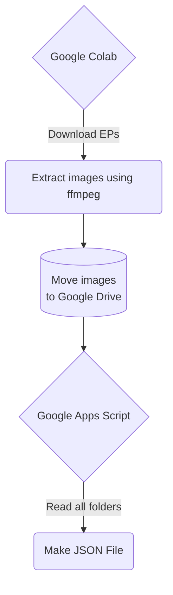

# tsurekano-api

### What is this?
Data as JSON for images form **tsurekano**

```mermaid
flowchart TD
    A{Google Colab} -- Download EPs --> B(Extract images using ffmpeg)
    B --> C[(Move images <br> to Google Drive)]
    C --> D{Google Apps Script} -- Read all folders --> E(Make JSON File)
```
